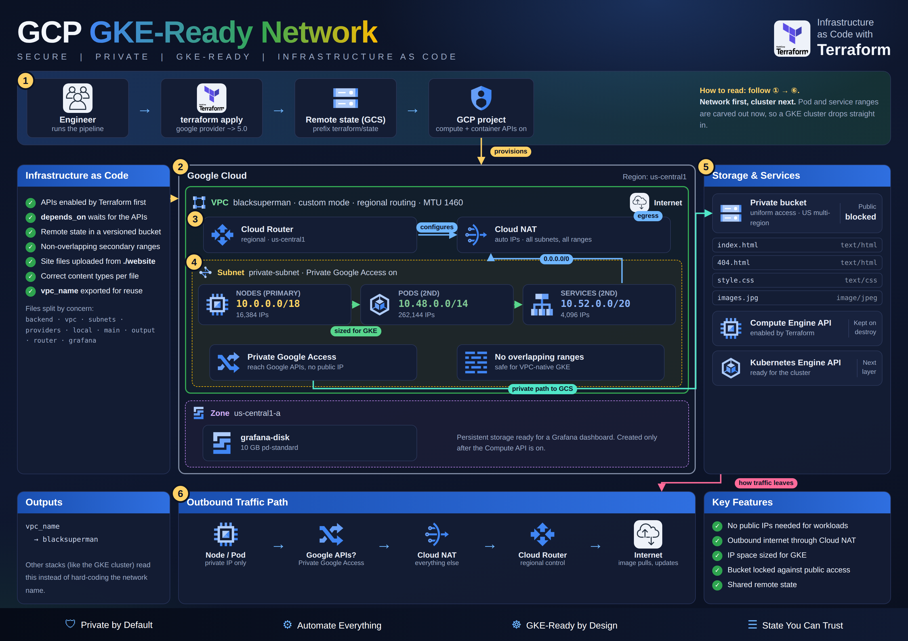

# GKE-Ready GCP Network with Terraform

 

## Mission Objective

I built a Google Cloud network using only Terraform, so the whole thing can be created, changed and torn down with a few commands. It's designed to host a Kubernetes (GKE) cluster later, and Terraform's state is kept in a cloud bucket instead of on my laptop.

**What it builds:**

* A custom VPC network
* A private subnet with IP ranges set aside for Kubernetes nodes, pods and services
* A Cloud Router and Cloud NAT, so private resources can reach the internet without public IPs
* A 10 GB persistent disk for Grafana dashboards
* A private Cloud Storage bucket holding a small static website
* A local text file, created with the Terraform `local` provider

## Project Layout

The Terraform code is split into numbered files, one per concern:

| File | What it does |
| --- | --- |
| `1-backend.tf` | Stores Terraform state in the `terraform-gke-benji` GCS bucket under `terraform/state` |
| `2-vpc.tf` | Enables the Compute and Kubernetes Engine APIs, then creates the `blacksuperman` VPC |
| `3-subnets.tf` | Creates `private-subnet` with GKE pod and service ranges |
| `4-providers.tf` | Pins the `google` (~> 5.0) and `local` (~> 2.5) providers; sets project and region |
| `5-local.tf` | Writes `favorite_food.txt` with the `local` provider |
| `6-main.tf` | Creates the private `benji2dmax-static` bucket and uploads the site files |
| `7-output.tf` | Outputs `vpc_name` |
| `8-router.tf` | Creates the Cloud Router and Cloud NAT |
| `9-grafana.tf` | Creates the 10 GB `grafana-disk` |
| `website/` | Static site files uploaded to the bucket |
| `Images/` | Screenshots and the architecture diagram |

## Checkpoints

1. [Prerequisites](#prerequisites)
2. [Step 1 - Network](#step-1---network)
3. [Step 2 - Router and NAT](#step-2---router-and-nat)
4. [Step 3 - Storage Bucket](#step-3---storage-bucket)
5. [Step 4 - Local File](#step-4---local-file)
6. [Step 5 - Deploy with Terraform](#step-5---deploy-with-terraform)
7. [Step 6 - Output](#step-6---output)
8. [Errors](#errors)
9. [Deliverables](#deliverables)
10. [Final Step - Teardown](#final-step---teardown)

## Prerequisites

* Terraform 1.9 or higher
* The `gcloud` CLI, signed in to a GCP project
* A Cloud Storage bucket created ahead of time to hold Terraform state (`terraform-gke-benji` in `1-backend.tf`)
* The project ID in `4-providers.tf` (`benjiondblock-class7point5`) changed to your own project if you're running this yourself

## Step 1 - Network

The VPC (`blacksuperman`) has no automatic subnets, so I control the address space. It uses regional routing and an MTU of 1460. One private subnet sits inside it in `us-central1`, with Private Google Access turned on so its resources can reach Google APIs without a public IP. It has a range for nodes plus two extra ranges reserved for Kubernetes pods and services:

| Range | Name | CIDR | Size |
| --- | --- | --- | --- |
| Nodes (primary) | `private-subnet` | `10.0.0.0/18` | 16,384 IPs |
| Pods (secondary) | `k8s-pod-range` | `10.48.0.0/14` | 262,144 IPs |
| Services (secondary) | `k8s-service-range` | `10.52.0.0/20` | 4,096 IPs |

The ranges don't overlap, which GKE requires for a VPC-native cluster.

Terraform also switches on the Compute and Kubernetes Engine APIs, so this works on a brand-new project. The APIs are set to stay on after `terraform destroy`.

In the GCP console, under **VPC network → Subnets**, the subnet and its secondary ranges show up as expected.

## Step 2 - Router and NAT

A Cloud Router and Cloud NAT give the private subnet outbound internet access without giving anything a public address. NAT picks its external IPs automatically and covers all subnets and all IP ranges, including the pod range.

A 10 GB standard persistent disk (`grafana-disk`) is also created in `us-central1-a`, ready to hold Grafana data later.

## Step 3 - Storage Bucket

The bucket (`benji2dmax-static`, US multi-region) has uniform access control and public access blocked. `force_destroy` is on, so `terraform destroy` deletes it even with files inside. Terraform uploads four site files into it: `index.html`, `404.html`, `style.css` and `images.jpg`.

## Step 4 - Local File

A small `local_file` resource writes `favorite_food.txt` on the machine running Terraform. It's a simple way to show that Terraform can manage things outside of any cloud provider.

## Step 5 - Deploy with Terraform

Run these commands in order:

* `terraform init` sets up the providers and the remote state backend
* `terraform validate` checks the code for mistakes
* `terraform plan` previews what will change
* `terraform apply` builds it

## Step 6 - Output

The project outputs the VPC name, so scripts or other Terraform modules can use it without hardcoding it. Running `terraform output` prints `blacksuperman`.

## Errors

* The site's `index.html` points to `image.jpg`, but the uploaded file is `images.jpg`, so the image doesn't load.
* The bucket is private, so it stores the site files but doesn't serve them to the public.

## Deliverables

* A working GCP network, router, NAT, disk and storage bucket, all created from code
* Terraform state stored remotely in Cloud Storage
* Screenshots of each step in the `Images/` folder

## Final Step - Teardown

Cloud resources cost money, so I don't leave this running.

1. Run `terraform destroy`.
2. Confirm with `yes`.
3. Check the GCP console to make sure everything is gone.

## Author

Benjamin Cooper
