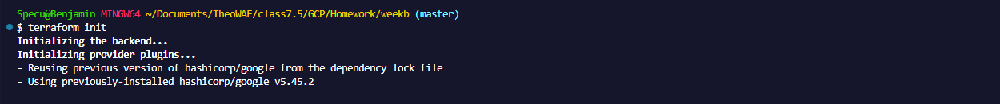
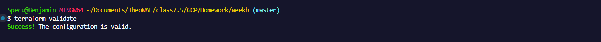
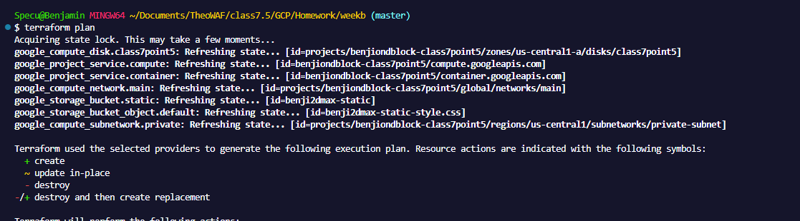
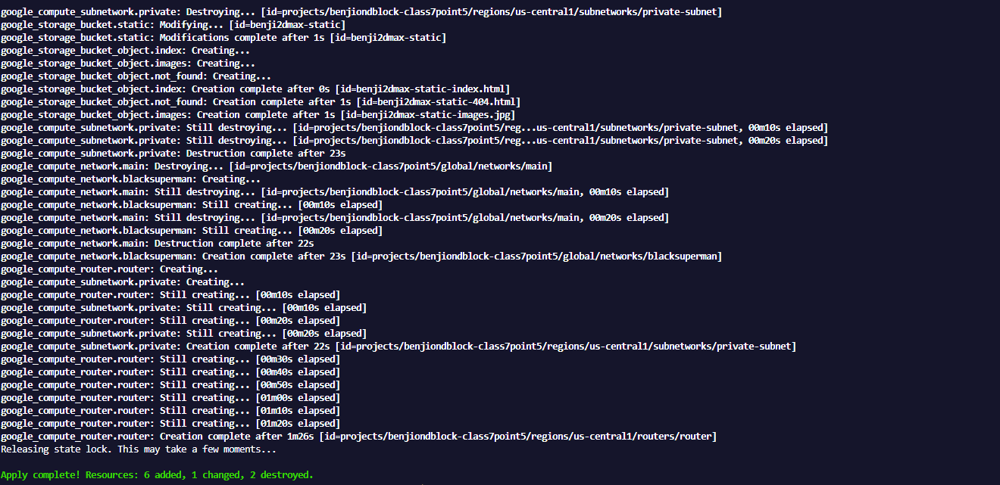
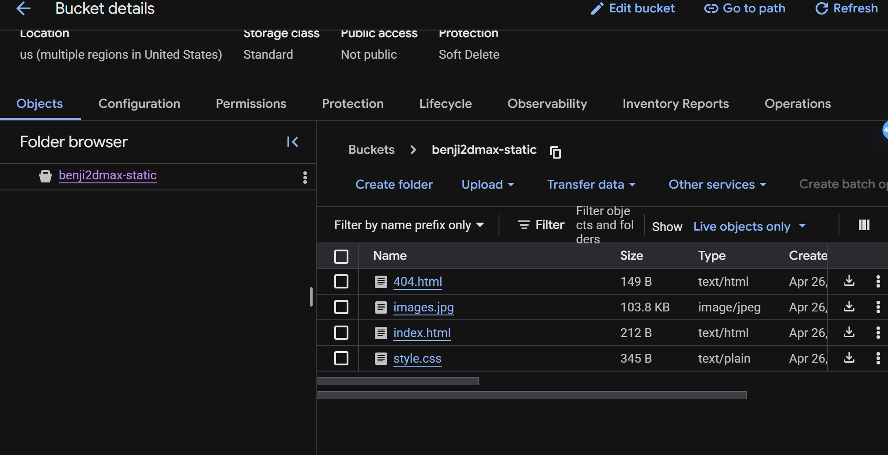
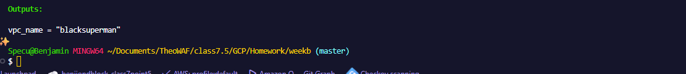
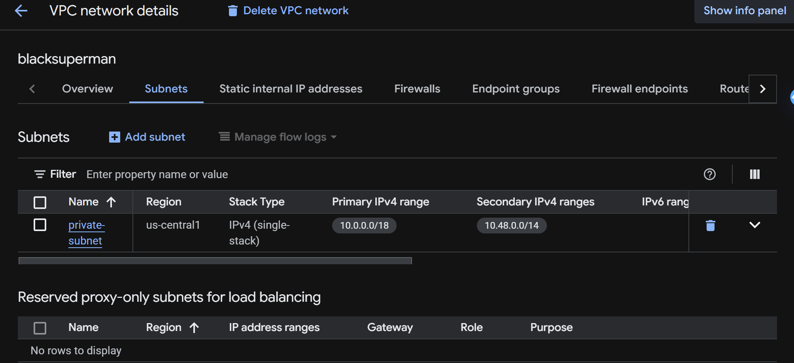

# Terraform GCP VPC & Static Site Provisioner


## What this is

A small but complete Infrastructure-as-Code project — the network, subnet, router, storage bucket, and static site sitting in it are all defined as code, stood up with `terraform` commands, and backed by remote state in a GCS bucket instead of my laptop.

I split the configuration into small, purpose-named files (`1-backend.tf`, `2-vpc.tf`, `3-subnets.tf`, `router.tf`, `main.tf`, `authentication.tf`) instead of dumping everything into one giant `main.tf`. It's a habit I picked up specifically because it makes it obvious where to look when something breaks.

## What actually gets built

* **A custom VPC** (`blacksuperman`) — no default subnets, regional routing mode, so I control the address space instead of Google auto-assigning it
* **A private subnet** (`private-subnet`) in `us-central1` with a primary range and two secondary ranges carved out for future GKE pod/service IPs — private Google access is turned on so resources inside it can reach Google APIs without a public IP
* **A Cloud Router** wired to that VPC (BGP ASN `64514`), the piece that would let this network talk to on-prem or other VPCs via Cloud NAT/VPN down the line
* **A GCS bucket** (`benji2dmax-static`) configured for uniform bucket-level access, hosting a tiny static site — `index.html`, `404.html`, `style.css`, and an image
* **A local file resource**, just to prove out `local_file` for generating config/output files outside of any cloud provider
* **Enabled APIs** (`compute.googleapis.com`, `container.googleapis.com`) via `google_project_service`, so the project doesn't fail on a fresh GCP project with those APIs off

## Prerequisites

* Terraform >= 1.9
* `gcloud` CLI authenticated against a GCP project
* A GCS bucket created ahead of time for remote state (Terraform can't bootstrap the backend it's about to use)

## Walkthrough

### 1. Init & validate

`terraform init` pulls the `hashicorp/google` provider and wires up the GCS backend; `terraform validate` catches syntax and internal-consistency issues before anything touches real infrastructure.




### 2. Plan

`terraform plan` refreshes state against what's actually deployed and prints the diff — what gets created, changed, or destroyed — before I commit to anything.



### 3. Apply

`terraform apply -auto-approve` executes that plan. In this run it tore down an older subnet/network (I'd renamed the VPC, which forces a replace) and rebuilt everything — network, subnet, router — then pushed the site files into the bucket. Finished clean: **6 added, 1 changed, 2 destroyed**.



### 4. Confirm the bucket

Back in the GCP console, the `benji2dmax-static` bucket has exactly the four objects Terraform uploaded: `404.html`, `images.jpg`, `index.html`, `style.css` — sizes and content types all correct, uniform access enforced, nothing public.



### 5. Check the output

`output.tf` exposes `vpc_name` so anything downstream (a script, a CI pipeline, another Terraform module) can reference the network by name without hardcoding it. Running `terraform output` confirms it resolves to `blacksuperman`.



### 6. Verify the subnet

Last check, back in the console under **VPC network → Subnets**: `private-subnet` exists in `us-central1` with the primary range `10.0.0.0/18` and the secondary range `10.48.0.0/14` visible — matching what's declared in `3-subnets.tf`.



## Teardown

Cloud resources cost money the moment they exist, so this doesn't stay up longer than it needs to for a demo:

```bash
terraform destroy
```

Confirm the prompt, then double-check the GCP console that the network, subnet, router, and bucket are actually gone — `terraform destroy` finishing without error is a good sign, not a guarantee.

## Author

Benjamin Cooper
